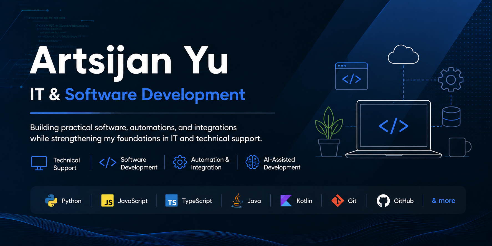

  

 

  Building practical software, automations, and integrations while strengthening my foundations in IT and technical support. 
  Interested in solving real-world problems through reliable technology and continuous learning.

---

## About Me

| Technical Support | Software Development | Automation & Integration |
| --- | --- | --- |
| Troubleshooting systems, software, and technical issues | Building practical tools and applications | Working with APIs, AI-assisted workflows, and business automation |

## Tech Stack

  
  
  
  
  
  
  
  

## Tools & Technologies

  
  
  

## What I Can Work On

- Software and system troubleshooting
- Technical support and issue investigation
- Business workflow automation
- REST API and webhook integrations
- AI-assisted software development
- OAuth and third-party platform integrations
- Real-time WebSocket applications

## Featured Projects

### [WorshipFlow](https://github.com/Sijan079/WorshipFlow)

Worship planning application for organizing services and keeping important planning information in one place.

## Professional Experience

**AI Software Developer — LionPath Advisors**

Worked on business automation, API integrations, and production software systems, including Meta Graph API integrations and real-time AI telephony infrastructure.

## Contact

