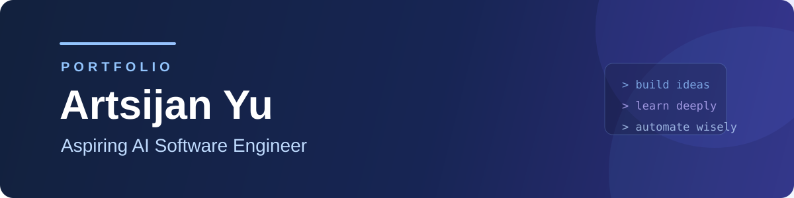

  

 

  Exploring how AI APIs can turn focused ideas into useful software. 
  Building practical tools, strengthening my engineering foundations, and gradually expanding into automation workflows.

---

## About Me

| Current Focus | Building | Growing Into |
| --- | --- | --- |
| AI-assisted software development | Focused desktop tools and hands-on projects | AI engineering and automation workflows |

## Tech Stack

  
  
  
  
  
  
  

## AI Agents 

  
  

## Featured Projects

### [Modly](https://github.com/Sijan079/Modly)

Modly is a desktop Minecraft instance and mod manager for organizing profiles, auditing mods, checking updates, and editing configuration files from one focused workspace.

### [WorshipFlow](https://github.com/Sijan079/WorshipFlow)

WorshipFlow is a worship planning project that helps organize services and keep key planning details in one place.

## Contact

